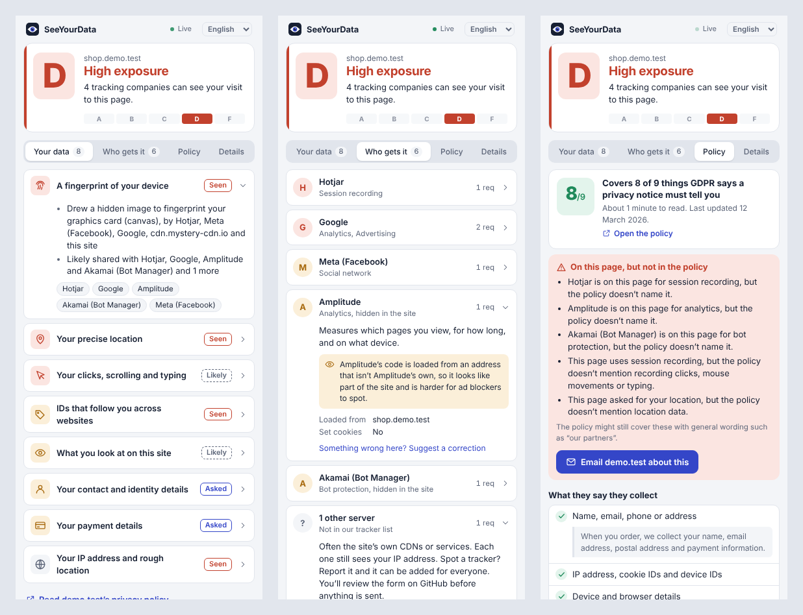
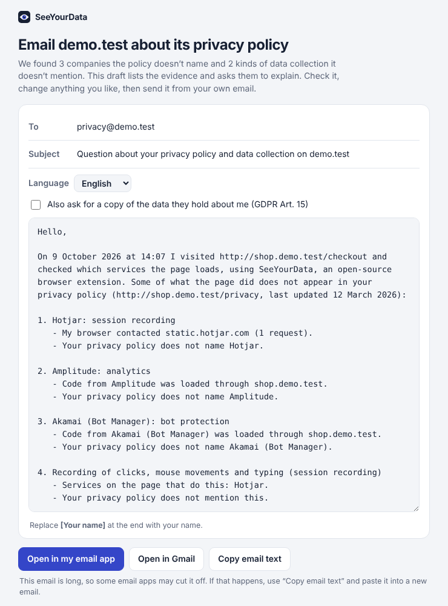

# SeeYourData

**See which personal data the website you're on can collect, and who receives it.**

SeeYourData is a free, open-source Chrome extension. Click its icon on any website and you get a plain-language report:

- **A grade from A to F** for how exposed you are on this page.
- **Your data**: what the page can learn about you, such as a fingerprint of your device, your location, your clicks and typing, IDs that follow you across sites, or the details its forms ask for.
- **Who gets it**: the companies this page sends data to (Google, Meta, Hotjar, ad exchanges…), what each one does, and which of their servers were contacted.
- **Policy**: reads the site's privacy policy for you (in English, German or Turkish) and shows what it says it collects and why, the legal reasons it gives, which of your rights it explains, and how many of the things GDPR requires a privacy notice to include are actually there. It also lists **what the page does that the policy leaves out**, such as a session recorder the policy never names.
- **Email the site**: when the page does something its policy leaves out, one click drafts a polite email to the site's privacy contact (found in the policy) with the evidence: which services, the exact servers your browser contacted, cookies, fingerprinting features, the date of your visit and the policy's address. It asks them to explain under GDPR Art. 13, optionally requests a copy of your data (Art. 15), and is available in English, German and Turkish. You edit it and send it from your own email app; SeeYourData never sends anything.
- **Details**: request counts, cookies, site storage, and how the grade is calculated.
- A direct link to the site's **privacy policy**, when the page has one.



*Left to right: what the page can learn about you, who receives it (including trackers hidden in the site's own domain), and what the privacy policy says and leaves out. Dark mode is supported too.*



The toolbar badge shows how many tracking companies are on the current page, coloured by the grade.

**Languages:** English, Deutsch and Türkçe. SeeYourData starts in your browser's language; switch it any time with the language menu at the top of the popup.

## Install

From source (until it's on the Chrome Web Store):

1. Download this repository: on [github.com/skraptt/seeyourdata](https://github.com/skraptt/seeyourdata) click **Code → Download ZIP**, then unzip it.
2. Open `chrome://extensions` in Chrome, Edge, Brave or any Chromium browser (version 111 or newer).
3. Turn on **Developer mode** (top right).
4. Click **Load unpacked** and choose the `seeyourdata` folder.
5. Pin the extension, visit a website, and click the icon.

Tabs that were already open before you installed it need one reload to get a full report.

## How it works

Everything happens locally in your browser. SeeYourData makes no network requests of its own and has no server, analytics or accounts.

| What | How it's detected | File |
| --- | --- | --- |
| Companies receiving data | Every request the page makes is matched against a list of known tracker domains. Requests are only observed, never blocked or changed. | `src/background.js`, `src/lib/trackers.js` |
| Trackers hidden in the site | Many sites serve tracker code from their own domain so it looks first-party and slips past ad blockers. SeeYourData also recognises tracker code by its file names and data paths (Amplitude, mParticle, Segment, Google tags, the Meta pixel, Adobe, Akamai and Cloudflare bot checks, and more). | `src/lib/trackers.js` (`SCRIPT_PATTERNS`) |
| Tracking cookies | Responses from other websites that set a cookie. | `src/background.js` |
| Device fingerprinting | Watches canvas read-back, WebGL GPU queries, audio fingerprinting, font probing, high-entropy client hints, battery and media-device listing, and notes which script used them. | `src/inject.js` |
| Location, camera, microphone, clipboard | Same hooks as above. | `src/inject.js` |
| Personal-data forms | Scans form fields for email, name, phone, address, birthday, password, card number and ID numbers (by type, `autocomplete`, name and label). Only field *types* are counted, never what you type. | `src/content.js` |
| Privacy policy | Looks for a "privacy" link in multiple languages. | `src/content.js` |
| Grade and wording | Pure function from the observations to the report. | `src/lib/analyze.js` |
| Privacy policy | When you ask, downloads the policy and matches key phrases (English, German, Turkish) for data collected, purposes, GDPR legal bases (Art. 6), your rights (Art. 15-22, 77) and the information Art. 13 requires. Every finding links to the sentence it's based on. It then compares the policy with what the page did. Keyword matching, not legal advice. | `src/lib/policy.js` |

Each finding is labelled:

- **Seen**: it happened in your browser on this page.
- **Likely**: a company on the page is known to collect this kind of data.
- **Asked**: the page has a form field for it.

### What it can't see

A browser extension only sees what happens in the browser. It can't see what a site does with your data on its own servers, data shared server-to-server, or what you've agreed to elsewhere. The grade is an indicator, not a legal assessment.

## Permissions, and why

| Permission | Why |
| --- | --- |
| `webRequest` + access to all sites | To see which servers each page contacts. Read-only. |
| `cookies` | To count the cookies the current site keeps. |
| `tabs` | To know which tab the popup is reporting on and to reload it on request. |
| `storage` | To keep each tab's findings in session memory, which is cleared when the browser closes. |

See [PRIVACY.md](PRIVACY.md).

## Development

No build step. Edit files, then click the reload icon on `chrome://extensions`.

```
manifest.json
src/
  background.js     service worker: network observation, per-tab state, badge
  content.js        form fields, storage counts, privacy-policy link
  inject.js         runs in the page: fingerprinting/location API hooks
  lib/
    analyze.js      observations -> report (grade, data kinds, companies)
    policy.js       privacy policy text -> summary and gaps
    complaint.js    gaps -> evidence -> email draft (EN/DE/TR)
    i18n.js         interface translations (English, German, Turkish)
    trackers.js     tracker database
    domain.js       host / registrable-domain helpers
popup/              the popup UI and the email draft page (HTML, CSS, JS, no frameworks)
icons/
_locales/           extension name and description per language
  config.js         GitHub repository used by the report links
tools/
  crawl.py          visits many sites, records outside servers
  rank.js           ranks them and writes a worklist of unknown ones
test/
  *.test.js         unit tests (node --test)
  e2e.py            loads the extension in Chromium against a demo page
```

```sh
npm test                    # unit tests, Node 18+
python test/e2e.py shots/   # end-to-end, needs: pip install playwright && playwright install chromium
npm run package             # builds seeyourdata.zip for the Chrome Web Store
```

## Growing the tracker list

The list in `src/lib/trackers.js` is written by this project and is MIT licensed like the code. It grows in two ways.

**Crawling popular websites.** `tools/crawl.py` visits many sites in a throwaway browser and records every outside server they contact, plus which scripts used fingerprinting features. `tools/rank.js` then ranks the servers by how many sites use them and writes a worklist of the ones we don't know yet, each with a ready-to-edit line and a suggested category.

```sh
pip install playwright && playwright install chromium
python tools/crawl.py --tranco 500 --accept-consent   # top 500 sites from the Tranco list
node tools/rank.js crawl-out/crawl.jsonl              # writes crawl-out/candidates.md and .csv
```

Use `--accept-consent` when crawling from the EU or UK: most large sites load no trackers until the cookie banner is accepted. The crawler clicks "Accept all" in its own empty browser profile, never yours. `rank.js` also prints how much outside traffic the current list recognises, so you can see coverage improve.

**Reports from users.** In the popup's "Who gets it" tab, every unknown server has a **Report** button, and every company has a "Suggest a correction" link. They open a pre-filled GitHub issue (`.github/ISSUE_TEMPLATE/tracker.yml`) containing only the server's domain and the website's domain. Nothing is sent until the person reviews and submits the form on GitHub.

Reports go to [github.com/skraptt/seeyourdata/issues](https://github.com/skraptt/seeyourdata/issues). If you fork the project, set your own repository in `src/config.js`.

## Contributing

The most valuable contribution is **growing the tracker list**. See [CONTRIBUTING.md](CONTRIBUTING.md).

Ideas on the roadmap:

- Firefox support (Manifest V3 with `browser.*`)
- Translations of the popup
- A history view: which companies saw you across the sites you visited today
- Reading a site's consent-banner choices and checking whether trackers load anyway
- Optional blocking of the worst categories

## License

[MIT](LICENSE)
